## Configuration and Deployment of HumanGov SaaS Application on AWS EC2 Inventory Across US States Using Ansible Securely Storing Configuration Files on AWS Code Commit.
](images/inage00.drawio.png)
# Project description 

In this project based on a real-world scenario, I used the Ansible configuration management automation to configure and deploy the innovative HumanGov SaaS application on AWS EC2 instances that will serve the entire United States.

This is a continuation from my previous post here where I implemented a flexible and scalable SaaS infrastructure on AWS using Terraform modules.

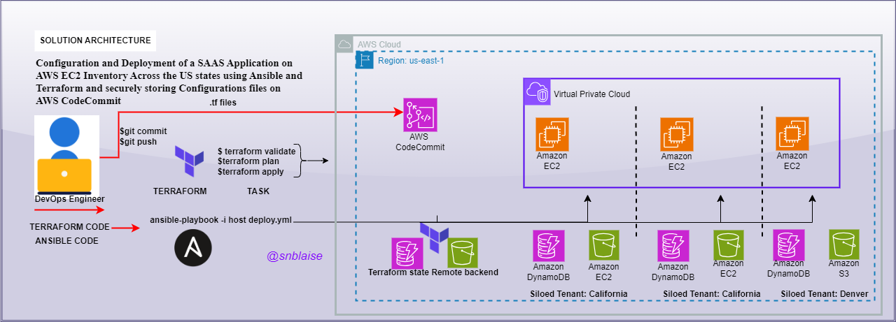

# Part 1
First, due to the limitation of Cloud9 managed credentials not being able to provision and attach an IAM role to an EC2 Instance, I used IAM and created a programatic access user and attached the “AdministratorAccess” AWS managed policy. I then created and saved the “Security Credentials” access key for this user.


## Pre-requisites

### Configure Cloud 9 with non-temporary credentials

- Create a new user on IAM with Admin privilege


- Disable the temporary credentials on Cloud9 by clicking on Settings > AWS Settings > Credentials > Turning Off the option “AWS managed temporary credentials”


- Configure the new IAM user credentials by running the `aws configure` command


### Update the HumanGov Terraform module as below:

```
cd human-gov-infrastructure/terraform
terraform show
terraform validate
terraform plan
terraform apply
terraform destroy -auto-approve
```

In order for EC2 to interact with S3 and DynamoDB I used Terraform to attach managed policies respectively so that the EC2 instance, through an IAM Instance Profile, can assume the role with the these policies attached in the resources.tf file. The Section of the code that achieve this is show below in the `modules/aws_humangov_infrastructure/main.tf` file.


Then added the IAM Instance Profile argument to the EC2 resource section of the `modules/aws_humangov_infrastructure/main.tf` file with the role attached

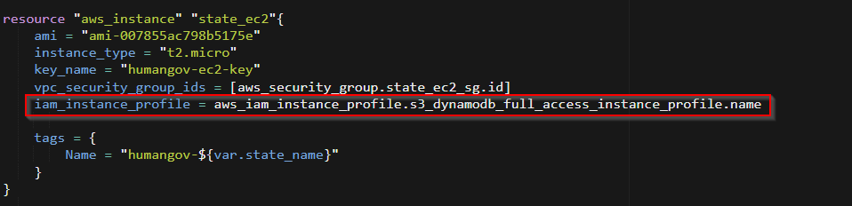

To give access to our application via the web and anable Flask to run port 5000 I made the following adjustment in the security group section resource section of our `modules/aws_humangov_infrastructure/main.tf` file.

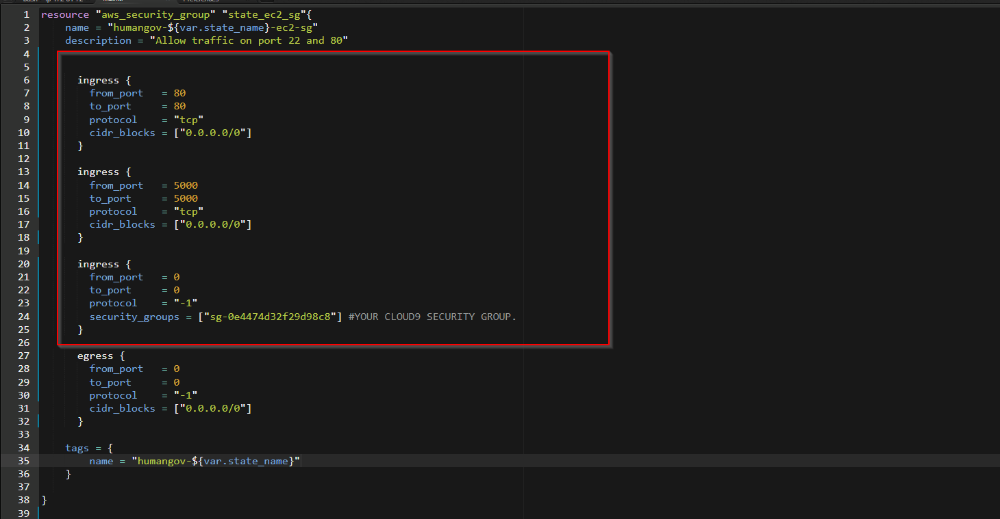


Next I Created a new SSH Key Pair on EC2 Dashboard with the name **humangov-ec2-key** to match with the key-name inside of the Terraform module and upload it to `/home/ec2-user/environment/` on AWS Cloud9. This key will allow cloud9-user to make further configurations using ansible. 

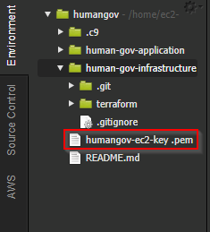

Provision the infrastructure on AWS using Terraform 

```bash
terraform plan
terraform apply
```
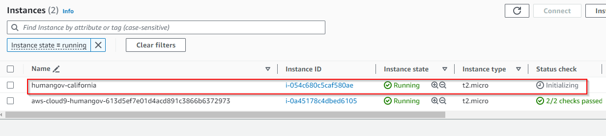


Once the infrastructure is provisioned and everything was working, I ran the following commands to commit my code to my local repo.

```bash
git status
git add .
git commit -m “Add IAM role to Terraform module/aws_humangov_infrastructure/resources.tf”
```

At this point the push command will fail since we turned off Cloud9 Credentials earlier. we will save this steps for later when must have finish our configurations. 

## Part 2 
## Depoying application in created infrastructure using ansible.

I navigated to the local directory of the humangove application, updated the `.gitignore` file with `.zip` file formate, created and  `src` and downloaded our application inside using `wget`. Thereafter unzip the file.

```bash
cd ~/environment/human-gov-application
echo "*.zip" >> .gitignore
mkdir src 
cd src
wget https://tcb-bootcamps.s3.amazonaws.com/tcb5001-devopscloud-bootcamp/v2/module4-ansible/humangov-app.zip
unzip humangov-app.zip
```

Once the file finish extracting I added all files and commited them to my local git repo for now. 

```bash
git status
git add .
git add ../.gitignore
git commit -m "HumanGov app 1st commit"
```

Now to provision the infrastructure with Terraform.
I added the three  `local-exec` provisioners to the EC2 resource in my terraform module main.tf file, `modules/aws_humangov_infrastructure/main.tf`

`cd modules/aws_humangov_infrastructure/main.tf`

The first was to dynamically store the IP addresses and public keys to the “known_hosts” file. If you don’t know, the known_hosts file is a crucial component that safeguards the authenticity of server connections for users. This file ensures the user is securely connecting to legitimate servers and verifies their identity on your local system. Additionally, it helps avoid any potential man-in-the-middle attacks.

I added the code below to the “aws_instance” “state_ec2” resource block.

# wait 30 seconds and dynamically add the private ip addresses to the known_hosts file


`provisioner “local-exec” {
command = “sleep 30; ssh-keyscan ${self.private_ip} >> ~/.ssh/known_hosts”
}`


The second was to dynamically add the environment variable values about the EC2 instance to the ansible hosts file in the default location.

# dynamically add environment variable values to the ansible hosts file in the default location

`provisioner “local-exec” {
command = “echo ${var.state_name} id=${self.id} ansible_host=${self.private_ip} ansible_user=ubuntu us_state=${var.state_name} aws_region=${var.region} aws_s3_bucket=${aws_s3_bucket.state_s3.bucket} aws_dynamodb_table=${aws_dynamodb_table.state_dynamodb.name} >> /etc/ansible/hosts”
}
`
For the interpolated value `${var.region}` above I added that variable to my `human-gov-infrastructure/terraform/modules/aws_humangov_infrastructure/variable.tf file`.

`variable “region” {
default = “us-east-1”
}`

The third was to dynamically remove the EC2 instance environment variables from the ansible hosts file when the infrastructure was destroyed.

# dynamically ‘delete’ the entry in the hosts file whenever the id(s) match on destroy
`provisioner “local-exec” {
command = “sed -i ‘/${self.id}/d’ /etc/ansible/hosts”
when = destroy
}`

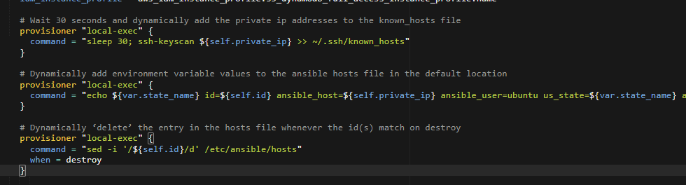


Next I created an *ansible* folder and an empty host file under `/etc` folder with the following commands as root:

```bash
sudo mkdir /etc/ansible
sudo touch /etc/ansible/hosts
```
The host file will be populated by the Terraform provisioner. 

Next I changed the permission of the ansible folder to allow the EC2 user and group, the user Terraform will be running as (ec2-user), to be able to write to the hosts file.

```bash
sudo chown ec2-user:ec2-user /etc/ansible/hosts
```

Also, to allows Terraform to write a temporary file inside the /etc/ansible folder to prevent permission denied error when destroying local-exec provisioner

```bash
sudo chown -R ec2-user:ec2-user /etc/ansible 
```

Provision the infrastructure

```bash
terraform plan
terraform apply -auto-approve
```

Once the infrastructure is provisioned, I confirmed that the environment variables for the EC2 instance was added to the ansible hosts file.
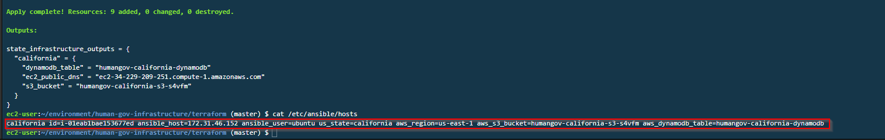

Now is time to commit this changes to the my local Git repository.

```bash
git status
git add .
git commit -m “Add variable and provisioners to Terraform module aws_humangov_infrastructure/main.tf”
```

## Now to deploy the application with Ansible.

I moved into the appropriate directory and created the directory, sub-directory and files for the role.

```bash
cd ~/environment/human-gov-infrastructure
mkdir ansible && cd ansible
mkdir -p roles/humangov_webapp/tasks
mkdir -p roles/humangov_webapp/handlers
mkdir -p roles/humangov_webapp/templates
mkdir -p roles/humangov_webapp/defaults
mkdir -p roles/humangov_webapp/vars
mkdir -p roles/humangov_webapp/files
```

I could have used the “ansible-galaxy” command as well which would have created a default structure similar to the above:

`ansible-galaxy role init roles/humangov_webapp`

I then created an ansible.cfg file in the ansible folder in order to override default behaviors.

`touch ansible.cfg`

Added the the following to the file.

```python
[defaults]
deprecation_warnings = False
```

Next I pinged the instance that is currently running using the ansible adhoc command:

`ansible all -m ping -e ansible_ssh_private_key_file=/home/ec2-user/environment/humangov-ec2-key.pem`
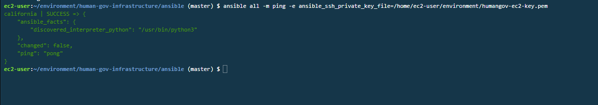

Now I created the necessary files using the touch command:

```console
touch roles/humangov_webapp/tasks/main.yml
touch roles/humangov_webapp/handlers/main.yml
touch roles/humangov_webapp/templates/nginx.conf.j2
touch roles/humangov_webapp/templates/humangov.service.j2
touch roles/humangov_webapp/defaults/main.yml
touch roles/humangov_webapp/vars/main.yml
touch deploy-humangov.yml
```
In the `default/main.yaml` file I included the default values for the role variables
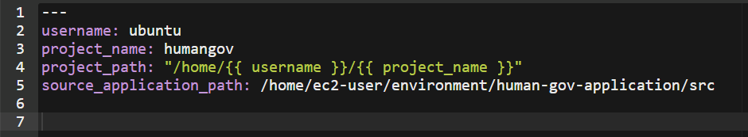

Then added the handlers in the `handlers/main.yml` file that are triggered by the “notify” keyword in the tasks/main.yml file.
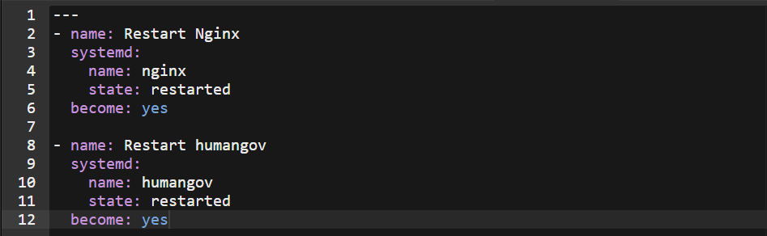

In the `tasks/main.yml` file I added the tasks in setting up the application environment.
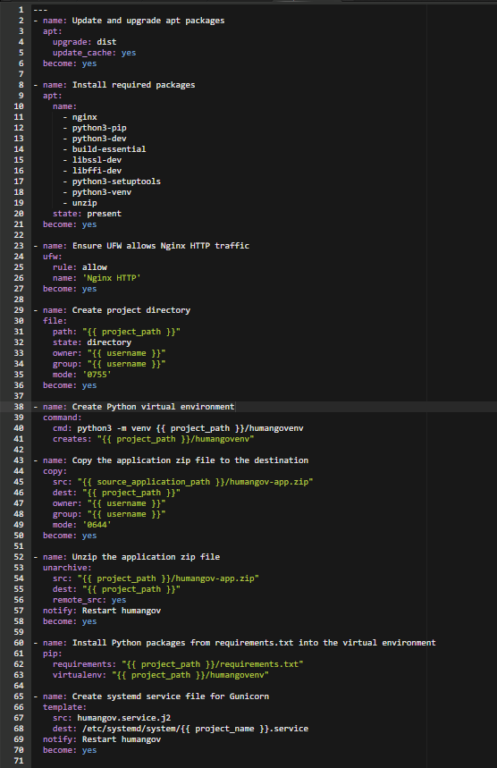

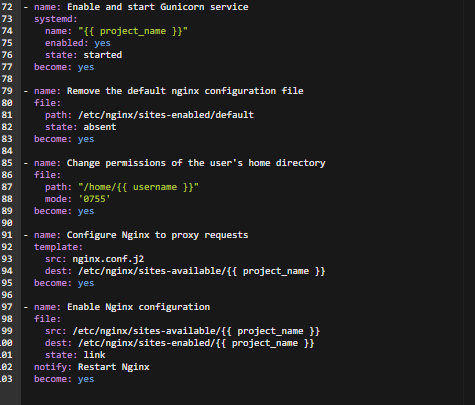

In the `templates/humangov.service.j2` file, I added the Jinja2 template for the Gunicorn systemd service:
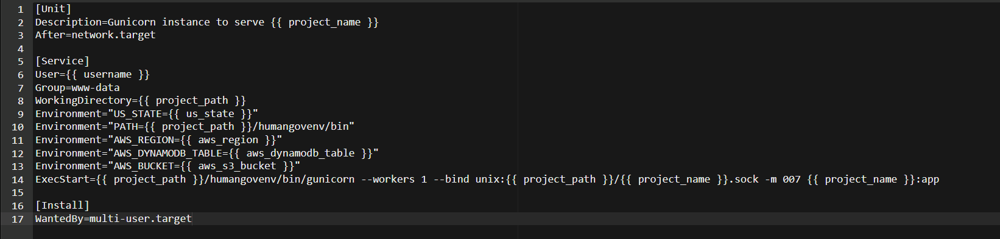
In templates/nginx.conf.j2, I added the Jinja2 template for the Nginx configuration
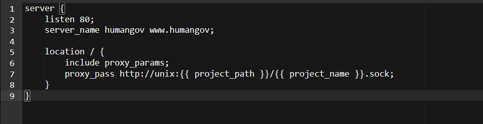

Then in order to use this role, I added the following to my “deploy-humangov.yml” playbook:
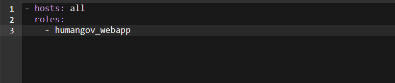

I was now able to run my playbook with the following command from inside the ansible folder:
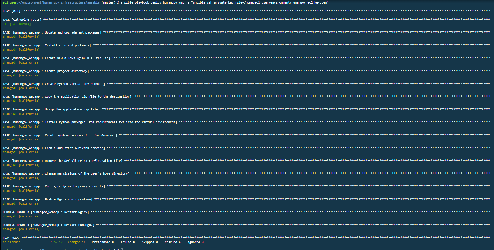
I used the public DNS address of the EC2 instance in my browser:
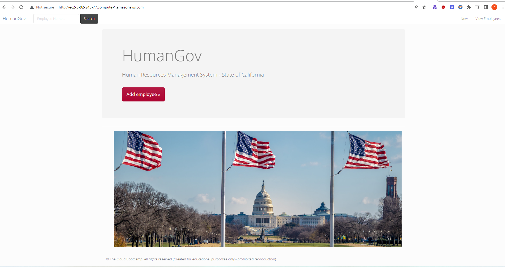
To deploy more states it’s simple as adding more states to Terraform /home/ec2-user/environment/human-gov-infrastructure/terraform/variables.tf file.
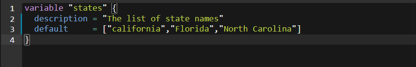

Run terraform commands:

`terraform apply -auto-approve`

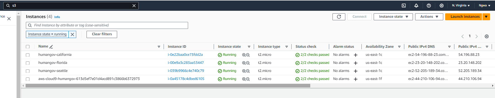
Once the instances are up and running and status check completed, just re-run the ansible playbook to install the application on the new EC2 resources.

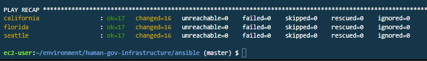

I then committed the changes to my local repo:

```python
cd ~/environment/human-gov-infrastructure
git status
git add .
git status
git commit -m “Ansible configuration 1st commit plus variables.tf file changed and added nevada and florida states”
```
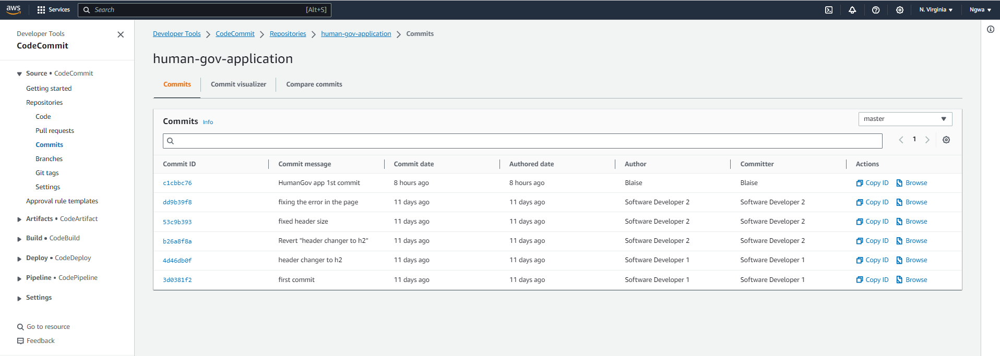

Before I could push the changes to Code Commit I enabled the temporary credentials on Cloud9. Settings > AWS Settings > Credentials > Turned On the option “AWS managed temporary credentials”.

Then I pushed the code to AWS Code Commit.

````bash
cd ~/environment/human-gov-application

git pull --rebase
git push -u origin 
````
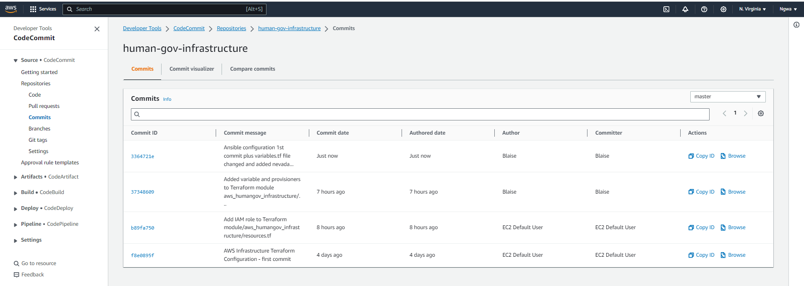
Another limitation for using the AWS managed temporary credentials on Cloud9 is that you will get an invalid security token error when you try to destroy “IAM policies/roles” resources using the terraform command. To get around this you must export the AWS Access Key ID and Secret Access key like so:

```python
export AWS_ACCESS_KEY_ID="<ACCESS_KE_ID>"
export AWS_SECRET_ACCESS_KEY="<SECRET_ACCESS_KEY>"
export AWS_REGION="us-east-1"
```

Then run the command:

`terraform destroy -auto-approve`

I hope you enjoyed this as much as I did. Automation with Terraform and Ansible is awesome!

## References
https://www.digitalocean.com/community/tutorials/how-to-serve-flask-applications-with-gunicorn-and-nginx-on-ubuntu-22-04

https://www.digitalocean.com/community/tutorials/how-to-install-nginx-on-ubuntu-22-04